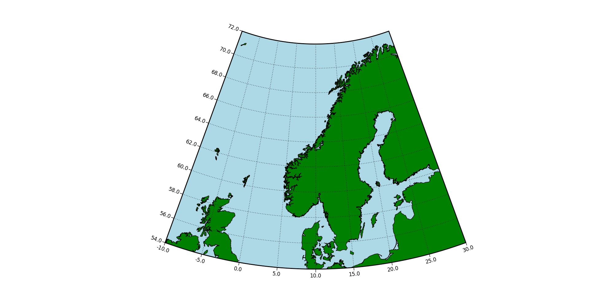

Polarmap
========

The standard map plotting package for python+matplotlib is `basemap
<http://matplotlib.org/basemap>`_. This is a flexible package with a
lot of map projections. However, it seems like basemap can not produce
non-rectangular regional polar stereographic maps like Matlab's
`m-map <http://www.eos.ubc.ca/~rich/map.htm>`_
or the `Generic Mapping Tools (GMT) <http://gmt.soest.hawaii.edu>`_.

This map type is useful for relatively high latitudes where
the Mercator projection is highly distorted.

Polarmap is a simple package providing this kind of functionality
for python+matplotlib. This is a poor man's solution. Better options
would be to include this kind of map in basemap or implement it using
matplotlib projection functionality. Both these approaches are too
complicated for me.

Files
-----

``makecoast.py``
  A script for producing a coast line file (using basemap).

``plotcoast.py``
  Quick and dirty script to check the output from ``makecoast.py``.

``polarmap.py``
  Module containing the class `PolarMap` for producing
  non-rectangular polar stereographic maps.

``example.py``
  An example script using `PolarMap` to produce the plot at the top of
  the page.

The module and the scripts works unchanged with both python2 and python3.

Example use
-----------

First a coast line is needed. The makecoast script uses basemap for
this task and saves it to a npy file. The coast line can be reused, using it
efficiently for multiple plots on the same map domain. Due to the curved
nature of the plot, it may be smart to make the coast file cover a
slightly larger area shown in the plot.
::

  from polarmap import PolarMap

  pmap = PolarMap(-10, 30, 54, 72, 'coast.npy',
                           facecolor='LightBlue')
  pmap.fillcontinents(facecolor='green', edgecolor='black')
  pmap.drawparallels([55, 60, 65, 70])
  pmap.drawmeridians([-10, 0, 10, 20, 30])

